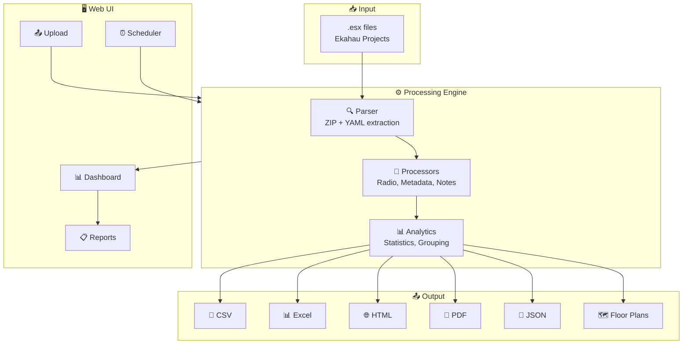
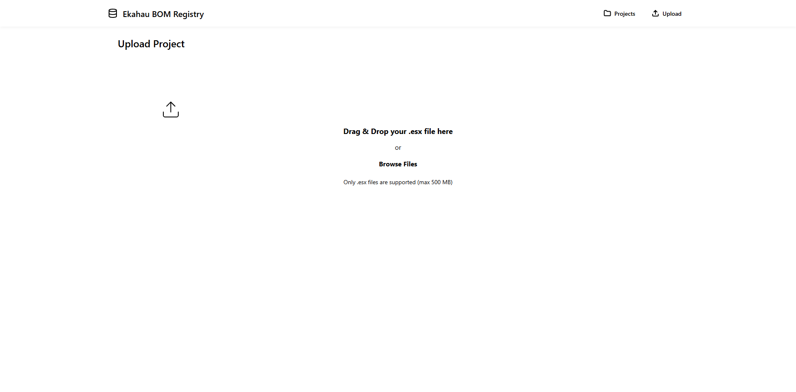
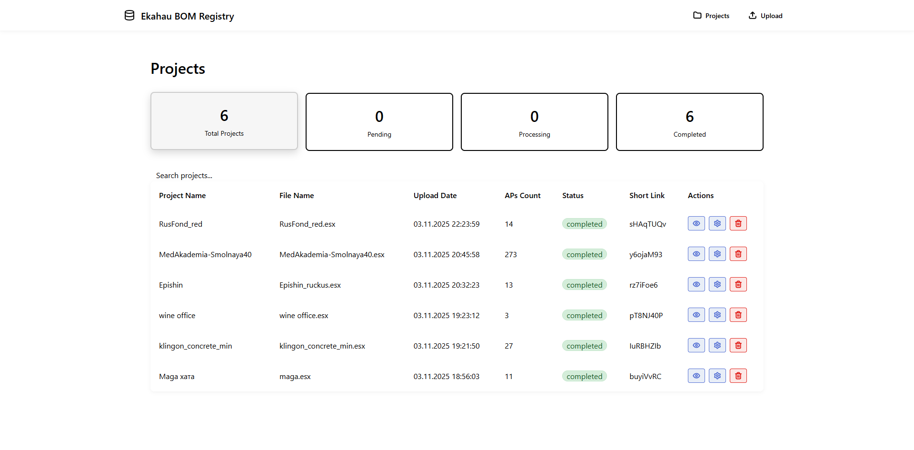
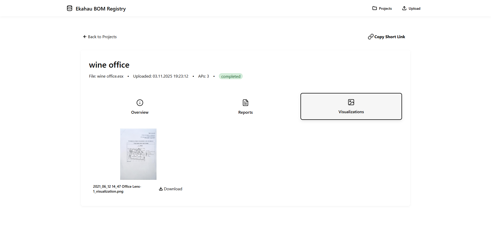
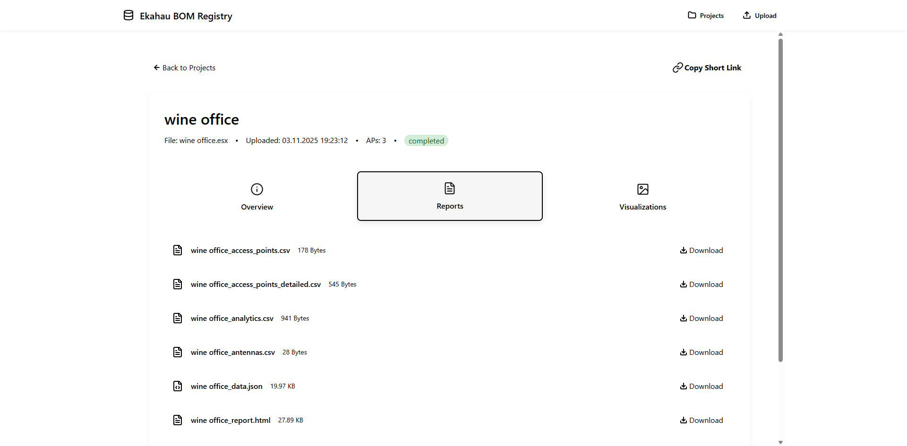
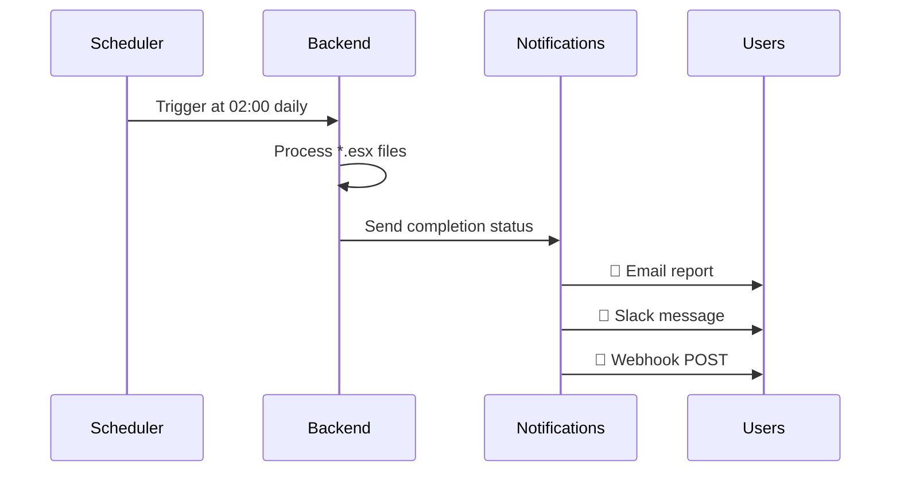

# 📡 EkahauBOM

> **Transform Ekahau Wi-Fi designs into professional BOM reports in seconds**

The ultimate toolkit for **Wi-Fi engineers** to generate equipment lists, visualize AP placements, and automate reporting workflows from Ekahau .esx project files.

[](https://www.python.org/downloads/)
[](LICENSE)
[](https://github.com/nimbo78/EkahauBOM/actions/workflows/tests.yml)
[](tests/)
[](https://github.com/nimbo78/EkahauBOM/releases)

**English** | [Русский](README.ru.md)

---

## ✨ Why Wi-Fi Engineers Love EkahauBOM

| Before EkahauBOM | After EkahauBOM |
|-----------------|-----------------|
| 😩 Manual AP counting in Ekahau | 🚀 One-click BOM generation |
| 📋 Copy-paste to Excel | 📊 Professional Excel/PDF reports |
| 🖼️ Screenshot floor plans | 🗺️ High-res PNG with AP overlays |
| ⏰ Hours of repetitive work | ⚡ Seconds of automation |
| 🔄 Re-process changed designs manually | 🤖 Scheduled automatic processing |
| 🔍 Manually compare design versions | 🔀 **Visual diff with movement arrows** |

---

## 🌟 What's New in v3.6.0

### 🔀 Project Version Comparison (NEW!)

**The killer feature for Wi-Fi design reviews!** Compare any two project versions with:

- **Visual floor plan diffs** - Color-coded markers with movement arrows
- **Accurate distances in meters** - Using project scale, not pixels
- **Complete change tracking** - Added, removed, modified, moved, renamed APs
- **Detailed field changes** - TX power, channel, azimuth, and more
- **Export reports** - CSV, HTML, JSON for documentation


*Example: 3 APs moved (blue→purple arrows show 1.4m, 2.0m, 3.1m movements)*

**CLI:**
```bash
python -m ekahau_bom old_design.esx --compare new_design.esx
```

**Web UI:** Auto-comparison on project update with dedicated Comparison tab

📖 [Full documentation](docs/PROJECT_COMPARISON.md) | [Example outputs](docs/examples/comparison_output/)

---

### 🐳 Docker Containerization (v3.5.0)

**Pre-built images from GitHub Container Registry:**
```bash
docker pull ghcr.io/nimbo78/ekahau-bom-backend:latest
docker pull ghcr.io/nimbo78/ekahau-bom-frontend:latest
```

**One-command deployment:**
```bash
docker-compose up --build
# Open http://localhost:8080
```

### 🔐 OAuth2/SSO Authentication (v3.5.0)

- Keycloak, Azure AD, Okta, Google Workspace
- Single Sign-On (SSO)
- Role-based access control

### 📱 Mobile-Friendly UI (v3.5.0)

- Responsive hamburger menu
- Card-based views on mobile
- Touch-friendly elements

### 🤖 Automation (v3.4.0)

**Scheduled batch processing** with notifications:
- 📧 Email reports
- 💬 Slack notifications
- 🔗 Webhooks to Jira/ServiceNow

### ⚡ Real-Time Updates

- WebSocket processing status
- Live dashboard with charts

### 💾 S3 Storage

- AWS S3, MinIO, Wasabi, Cloudflare R2

---

## 🏗️ Architecture



---

## 🚀 Quick Start

### Option 1: Web UI (Recommended for Teams)

```bash
# Clone & setup
git clone https://github.com/nimbo78/EkahauBOM.git
cd EkahauBOM

# Backend (Terminal 1)
cd ekahau_bom_web/backend
python -m venv venv && venv\Scripts\activate  # Linux: source venv/bin/activate
pip install -r requirements.txt
uvicorn app.main:app --port 8001 --reload

# Frontend (Terminal 2)
cd ekahau_bom_web/frontend/ekahau-bom-ui
npm install && npm start

# Open http://localhost:4200 🎉
```

### Option 2: CLI (Quick & Scriptable)

```bash
pip install ekahau-bom

# Simple BOM
ekahau-bom project.esx

# Full export with visualizations
ekahau-bom project.esx \
  --format csv,excel,html,pdf \
  --visualize-floor-plans \
  --show-azimuth-arrows

# Batch processing (multiple projects)
ekahau-bom --batch projects/ \
  --parallel 4 \
  --aggregate-report
```

---

## 🖥️ Web UI Features

### 📤 Drag & Drop Upload



Upload single files or entire batches with drag-and-drop. Configure processing options and watch real-time progress.

**Keyboard Shortcuts:**
| Key | Action |
|-----|--------|
| `Alt+U` | Quick upload (admin) |
| `Ctrl+K` or `/` | Focus search |
| `←` `→` | Navigate tabs |
| `1-4` | Jump to tab |

### 📊 Project Dashboard



Search, filter, and manage all your Ekahau projects. See processing status, AP counts, and quick stats at a glance.

### 🗺️ Floor Plan Visualizations



Interactive floor plans with:
- 📍 AP placement overlay (Ekahau colors)
- ➡️ Azimuth arrows for directional antennas
- 🔍 Zoom/pan controls
- 🖼️ Lightbox modal for full-screen view

### 📋 Multi-Format Reports



Download reports in any format directly from browser:
- **CSV** - Import to Excel, databases, scripts
- **Excel** - Professional workbook with multiple sheets
- **HTML** - Interactive web report
- **PDF** - Print-ready documentation
- **JSON** - Integration with other tools

### ⏰ Scheduled Processing



**Cron Presets:**
- 🌅 Daily at 2 AM: `0 2 * * *`
- 📅 Weekly Monday 9 AM: `0 9 * * 1`
- 📆 Monthly 1st day: `0 0 1 * *`
- ⏱️ Every hour: `0 * * * *`

---

## 📊 What's in the Reports?

### Access Point BOM

| Model | Vendor | Qty | Floor | Band |
|-------|--------|-----|-------|------|
| AP-655 | Aruba | 12 | Floor 1 | 5GHz |
| C9130AXI | Cisco | 8 | Floor 2 | 6GHz |
| MR46 | Meraki | 15 | Floor 3 | Dual |

### Radio Analytics

- 📶 **Frequency bands**: 2.4GHz, 5GHz, 6GHz distribution
- 📻 **Channels**: Channel utilization and overlap analysis
- 📡 **TX Power**: Power level distribution
- 🔧 **Wi-Fi Standards**: 802.11ax/ac/n breakdown

### Installation Parameters

- 📍 **Coordinates**: X, Y, Height for each AP
- 🧭 **Azimuth**: Antenna pointing direction
- 📐 **Tilt**: Up/down angle for directional antennas
- 🏗️ **Mounting**: Ceiling, wall, bracket types

### Cable Infrastructure

- 📏 **Cable lengths**: Per-AP and total
- 🔌 **Cable types**: Cat6, Cat6A, fiber
- 💰 **Cost estimation**: Based on cable pricing

---

## 🎯 Use Cases

### For Wi-Fi Engineers 📡

```bash
# After completing Ekahau design
ekahau-bom "Office Building Q4.esx" \
  --format excel \
  --visualize-floor-plans \
  --show-azimuth-arrows \
  --output-dir "Customer Deliverables"
```

**Result**: Professional BOM + floor plan PNGs ready for customer delivery.

### For Procurement Teams 💼

```bash
# Generate purchasing list
ekahau-bom project.esx \
  --format csv \
  --group-by vendor
```

**Result**: Vendor-grouped CSV for purchase orders.

### For Installation Crews 🔧

```bash
# Per-floor installation guide
ekahau-bom project.esx \
  --format html \
  --group-by floor \
  --visualize-floor-plans
```

**Result**: Floor-by-floor HTML with AP locations and mounting details.

### For Operations Teams 🤖

**Web UI Scheduled Processing:**
1. Create schedule: "Process //fileserver/ekahau/*.esx daily at 2 AM"
2. Configure: Email report to ops-team@company.com
3. Enable: Toggle on and forget

**Result**: Automatic daily reports without manual intervention.

---

## 📁 Output Structure

```
📂 output/
├── 📄 Project_access_points.csv          # Main BOM
├── 📄 Project_access_points_detailed.csv # Full AP details
├── 📄 Project_antennas.csv               # Antenna inventory
├── 📄 Project_analytics.csv              # Radio analytics
├── 📊 Project_report.xlsx                # Excel workbook
├── 🌐 Project_report.html                # Interactive HTML
├── 📑 Project_report.pdf                 # Print-ready PDF
├── 💾 Project_data.json                  # Machine-readable JSON
└── 📂 visualizations/
    ├── 🗺️ Floor_1_visualization.png
    ├── 🗺️ Floor_2_visualization.png
    └── 🗺️ Floor_3_visualization.png
```

---

## ⚙️ CLI Reference

### Basic Commands

```bash
# Simple export (CSV default)
ekahau-bom project.esx

# Multiple formats
ekahau-bom project.esx --format csv,excel,html,pdf,json

# Custom output directory
ekahau-bom project.esx --output-dir ./reports
```

### Grouping Options

```bash
--group-by model   # Group by AP model
--group-by floor   # Group by floor
--group-by vendor  # Group by vendor (Cisco, Aruba, etc.)
--group-by color   # Group by Ekahau color
--group-by tag     # Group by custom tags
```

### Visualization Options

```bash
--visualize-floor-plans    # Generate floor plan PNGs
--show-azimuth-arrows      # Add directional arrows
--ap-opacity 0.6           # Set overlay opacity (0.1-1.0)
--ap-circle-radius 25      # Set AP marker size
--no-ap-names              # Hide AP name labels
```

### Batch Processing

```bash
# Process entire directory
ekahau-bom --batch projects/

# Parallel execution (1-8 workers)
ekahau-bom --batch projects/ --parallel 4

# With aggregated report
ekahau-bom --batch projects/ --aggregate-report

# File filtering
ekahau-bom --batch projects/ \
  --batch-include "*office*.esx" \
  --batch-exclude "*backup*"
```

---

## 🔧 Configuration

### Web UI Environment (.env)

```bash
# Storage (default: local)
STORAGE_BACKEND=local          # or 's3'

# S3 Configuration (if using S3)
S3_BUCKET_NAME=ekahau-bom
S3_REGION=us-east-1
S3_ACCESS_KEY=your_key
S3_SECRET_KEY=your_secret

# Email Notifications (optional)
SMTP_HOST=smtp.gmail.com
SMTP_PORT=587
SMTP_USERNAME=your-email@gmail.com
SMTP_PASSWORD=your-app-password
SMTP_USE_TLS=true

# Slack Notifications (optional)
SLACK_WEBHOOK_URL=https://hooks.slack.com/services/...
```

### Storage Options

| Backend | Best For | Features |
|---------|----------|----------|
| **Local** | Single server | Simple, automatic archiving |
| **AWS S3** | Enterprise | Unlimited, highly available |
| **MinIO** | Self-hosted | Free, S3-compatible |
| **Wasabi** | Cost-sensitive | 80% cheaper than AWS |
| **Cloudflare R2** | High egress | Zero egress fees |

---

## 🧪 Testing

```bash
# Run all tests
pytest tests/ -v

# With coverage
pytest tests/ --cov=ekahau_bom --cov-report=html

# Quick tests only (skip slow integration)
pytest tests/ -m "not slow"
```

**Current stats**: 600+ tests | 86% coverage | 3 OS × 5 Python versions

---

## 📚 Documentation

| Document | Description |
|----------|-------------|
| [CLI Reference](docs/CLI_REFERENCE.md) | Complete command-line options |
| [User Guide](docs/USER_GUIDE.md) | Step-by-step usage guide |
| [Web UI Guide](docs/examples/WEB_UI_GUIDE.md) | Web interface walkthrough |
| [Developer Guide](docs/DEVELOPER_GUIDE.md) | Contributing and development |
| [Extending Guide](docs/EXTENDING.md) | Add custom exporters/processors |

---

## 🗺️ Roadmap

### ✅ Recently Completed (v3.5.0)

- [x] 🐳 Docker containerization
- [x] 🔐 OAuth2/Keycloak SSO authentication
- [x] 📱 Mobile-friendly UI
- [x] 🤖 Scheduled batch processing with cron
- [x] 📧 Email/Slack/Webhook notifications
- [x] ⚡ WebSocket real-time updates
- [x] 📋 Batch templates
- [x] 📊 Analytics dashboard with charts
- [x] 🏷️ Tags and advanced filtering
- [x] 💾 S3 storage backend

### 🔜 Coming Soon

- [ ] 🔄 Ekahau Cloud integration
- [ ] 📊 Project version comparison
- [ ] 📈 Advanced analytics

---

## 🤝 Contributing

Contributions welcome! See [CONTRIBUTING.md](CONTRIBUTING.md) for guidelines.

```bash
# Setup development environment
git clone https://github.com/nimbo78/EkahauBOM.git
cd EkahauBOM
pip install -e ".[dev]"
pre-commit install
```

---

## 📄 License

MIT License - see [LICENSE](LICENSE) for details.

---

## 📧 Contact

- **Issues**: [GitHub Issues](https://github.com/nimbo78/EkahauBOM/issues)
- **Author**: Igor Singosin

---

<div align="center">

**Built with ❤️ for the Wi-Fi engineering community**

⭐ Star this repo if EkahauBOM saves you time!

</div>
