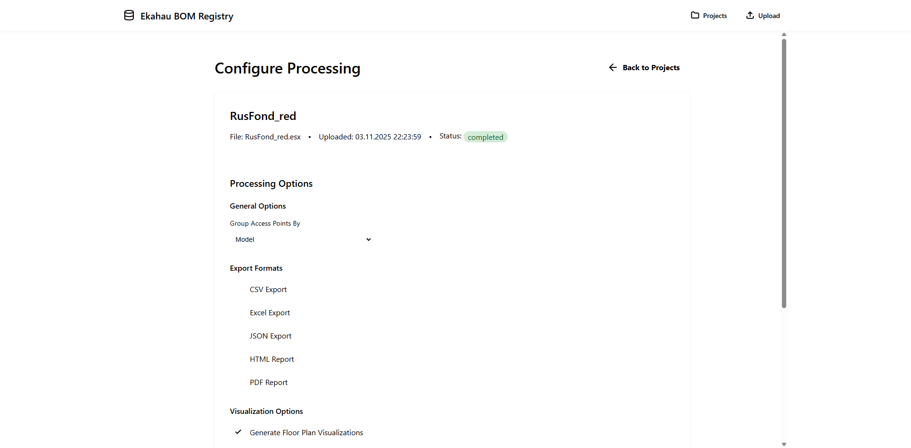

# EkahauBOM

> **Professional BOM generator + Web UI for Ekahau Wi-Fi projects**

Generate comprehensive equipment reports from Ekahau .esx files via **CLI** or **Web Interface**. Built for Wi-Fi engineers, procurement teams, and installation crews.

[](https://www.python.org/downloads/)
[](LICENSE)
[](https://github.com/nimbo78/EkahauBOM/actions/workflows/tests.yml)
[](tests/)
[](https://github.com/nimbo78/EkahauBOM/releases)

**English** | [Русский](README.ru.md)

---

## 🌟 What's New in v3.3.0

### 🚀 Batch Processing System - Process Multiple Projects

**CLI Batch Processing:**
- Process multiple .esx files with a single command
- Parallel execution with configurable workers (1-8)
- Aggregated BOM reports combining data from all projects
- File filtering with glob patterns (include/exclude)
- Progress tracking with Rich library

**Web UI Batch Management:**
- Multi-file upload with drag-and-drop
- Batch dashboard with real-time status tracking
- Per-project progress monitoring
- Aggregate reports across all batch projects
- Background processing with parallel workers

**Comprehensive Testing:**
- 595 tests passing with 85% code coverage
- 51 CLI batch tests (38 unit + 13 integration)
- 6 Web UI load tests with excellent performance
- E2E validation: 12 batches, 56 projects, 3622 APs tested

[See Batch Processing Guide](#-batch-processing-new-in-v330) →

---

### 🎉 Web UI - Centralized Project Registry

Upload, process, and share Ekahau projects via web browser:

- **Drag-and-drop upload** with real-time processing
- **Project dashboard** with search and filters
- **Floor plan visualizations** with zoom/pan
- **Download reports** (CSV, Excel, HTML, PDF, JSON)
- **Short link sharing** for easy collaboration
- **Flexible storage** - Local filesystem or S3-compatible cloud storage
- **No database required** - JSON-based metadata

[See Web UI Guide](#-web-ui-new-in-v300) →

---

## Key Features

### 📊 Reports & Analytics

- **5 export formats**: CSV, Excel, HTML, JSON, PDF
- **Radio analytics**: Frequency bands, channels, TX power, Wi-Fi standards
- **Cost calculation**: Equipment pricing with volume discounts
- **Installation params**: Mounting height, azimuth, tilt, coordinates
- **Cable infrastructure**: Length calculations, BOM, cost estimation
- **Map notes**: Text notes, cable paths, picture markers

### 🗺️ Floor Plan Visualizations

- **AP placement overlay** with Ekahau colors
- **Azimuth arrows** for directional antennas
- **Adjustable opacity** (10-100%)
- **High-res PNG export** for documentation

---

## 🚀 Quick Start

### Option 1: Web UI (Recommended)

```bash
# Clone repository
git clone https://github.com/nimbo78/EkahauBOM.git
cd EkahauBOM

# Setup backend
cd ekahau_bom_web/backend
python -m venv venv
source venv/bin/activate  # Windows: venv\Scripts\activate
pip install -r requirements.txt

# Setup frontend
cd ../frontend/ekahau-bom-ui
npm install

# Run servers (2 terminals)
# Terminal 1 - Backend
cd ekahau_bom_web/backend
uvicorn app.main:app --port 8001

# Terminal 2 - Frontend
cd ekahau_bom_web/frontend/ekahau-bom-ui
npm start

# Open http://localhost:4200
```

### Option 2: CLI Only

```bash
pip install ekahau-bom

ekahau-bom myproject.esx \
  --format csv,excel,html \
  --visualize-floor-plans \
  --show-azimuth-arrows
```

---

## 🖥️ Web UI _(New in v3.0.0)_

### Upload & Process


Drag-and-drop .esx files with instant upload and processing queue.

**Keyboard Shortcuts**: Navigate faster with global shortcuts:
- `Alt+U` - Quick upload (admin only)
- `Ctrl+K` or `/` - Focus search
- `Escape` - Clear search
- `←/→` - Navigate between tabs
- `1-4` - Jump to specific tab

### Project Dashboard


Search, filter, and manage all uploaded projects. Real-time status tracking.

### Floor Plan Visualizations


Interactive floor plans with zoom/pan and lightbox modal for full-screen viewing.

### Reports Download


Download reports in all formats directly from browser.

### Configuration



Configure all processing options via web interface:
- Grouping (by model, floor, vendor, color, tag)
- Output formats (CSV, Excel, HTML, PDF, JSON)
- Visualizations with azimuth arrows and custom opacity
- Real-time progress tracking

### Batch Processing

Process multiple .esx files simultaneously with comprehensive batch management:

**Features:**
- **Multi-file upload** - Drag-and-drop multiple files or select via browse dialog
- **Batch dashboard** - View all batches with status filtering and pagination
- **Real-time monitoring** - Per-project status tracking with progress indicators
- **Background processing** - Configurable parallel workers (1-8) for faster completion
- **Aggregate reports** - Combined BOM reports across all projects in batch
- **Batch actions** - View details, monitor progress, or delete entire batches

**Usage:**
1. Navigate to **Batch Upload** from the admin menu
2. Drag-and-drop multiple .esx files (or click to browse)
3. Configure processing options (grouping, formats, visualizations)
4. Set parallel workers for optimal performance
5. Monitor progress in the **Batches** dashboard
6. Download aggregate reports when processing completes

### Storage Backends

**Flexible storage options**: Choose between local filesystem or cloud S3-compatible storage:

**Local Storage** (default):
- Simple file-based storage in `projects/` directory
- Automatic archiving of old projects (60+ days → tar.gz, 60-70% space savings)
- Perfect for single-server deployments

**S3-Compatible Storage** (AWS S3, MinIO, Wasabi, DigitalOcean Spaces):
- Unlimited scalability and redundancy
- Multi-server deployments with shared storage
- Built-in lifecycle policies for cost optimization
- Migration tool for seamless local ↔ S3 transfers

Configure via `.env`:
```bash
# Local storage (default)
STORAGE_BACKEND=local

# S3 storage
STORAGE_BACKEND=s3
S3_BUCKET_NAME=ekahau-bom-projects
S3_REGION=us-east-1
S3_ACCESS_KEY=your_access_key
S3_SECRET_KEY=your_secret_key
```

**Migration between backends**:
```bash
# Migrate all projects from local to S3
python -m app.utils.migrate_storage local-to-s3 --all

# Migrate specific project
python -m app.utils.migrate_storage s3-to-local --project-id <uuid>
```

See [Backend README](ekahau_bom_web/backend/README.md) for complete S3 configuration examples (AWS, MinIO, Wasabi, DigitalOcean, Corporate S3).

### Archive Management

**Automatic space savings** (Local storage only): Old projects (not accessed for 60+ days) are automatically compressed to tar.gz archives, saving 60-70% disk space. Projects are transparently decompressed on first access.

**Background job** (optional, requires cron/Task Scheduler):
```bash
# Run weekly to archive old projects (local storage only)
python -m app.tasks.archive_old_projects
```

**Note**: S3 storage doesn't need archiving - use S3 lifecycle policies instead.

---

## 📖 CLI Usage

### Basic Export

```bash
# Simple CSV export
ekahau-bom project.esx

# Multiple formats
ekahau-bom project.esx --format csv,excel,html,pdf

# Custom output directory
ekahau-bom project.esx --output-dir ./reports
```

### Grouping & Analytics

```bash
# Group by AP model
ekahau-bom project.esx --group-by model

# Group by floor
ekahau-bom project.esx --group-by floor

# Group by vendor
ekahau-bom project.esx --group-by vendor
```

### Floor Plan Visualizations

```bash
# Generate floor plans with APs
ekahau-bom project.esx --visualize-floor-plans

# With azimuth arrows
ekahau-bom project.esx \
  --visualize-floor-plans \
  --show-azimuth-arrows

# Custom opacity (0.0-1.0)
ekahau-bom project.esx \
  --visualize-floor-plans \
  --ap-opacity 0.4

# Hide AP names on visualizations
ekahau-bom project.esx \
  --visualize-floor-plans \
  --no-ap-names
```

### Advanced Options

```bash
# Custom project name (for reports)
ekahau-bom project.esx --project-name "Office Building 2024"

# Custom AP circle radius (for visualizations)
ekahau-bom project.esx \
  --visualize-floor-plans \
  --ap-circle-radius 20

# Enable verbose logging
ekahau-bom project.esx --verbose
```

### 🆕 Batch Processing _(New in v3.3.0)_

Process multiple .esx files with parallel execution and aggregated reports:

```bash
# Process all .esx files in directory
ekahau-bom --batch projects/ --format csv

# Parallel processing with 4 workers
ekahau-bom --batch projects/ \
  --parallel 4 \
  --format csv,excel

# With aggregated report
ekahau-bom --batch projects/ \
  --parallel 4 \
  --aggregate-report \
  --format csv

# File filtering with glob patterns
ekahau-bom --batch projects/ \
  --batch-include "*office*.esx" \
  --aggregate-report

# Exclude specific files
ekahau-bom --batch projects/ \
  --batch-exclude "*backup*.esx" \
  --parallel 4 \
  --aggregate-report

# Full example with all options
ekahau-bom --batch projects/ \
  --parallel 8 \
  --aggregate-report \
  --format csv,excel,html \
  --group-by model \
  --visualize-floor-plans \
  --output-dir batch_output
```

**Batch Features:**
- **Parallel processing**: 1-8 workers for faster completion
- **Aggregated BOM**: Combined reports across all projects
- **File filtering**: Include/exclude patterns with wildcards
- **Progress tracking**: Real-time progress with Rich library
- **Error handling**: Continue processing on individual file errors
- **Summary reports**: Batch statistics and error logs

**Output Structure:**
```
batch_output/
├── project1/                    # Individual project outputs
│   ├── project1_access_points.csv
│   └── ...
├── project2/                    # Individual project outputs
│   ├── project2_access_points.csv
│   └── ...
└── summary/                     # Batch aggregated reports
    ├── batch_summary.txt        # Processing statistics
    ├── batch_aggregate.csv      # Combined BOM report
    └── batch_errors.log         # Error log (if any)
```

---

## 📁 Output Structure

```
output/
├── Project_Name_access_points.csv          # Main BOM
├── Project_Name_access_points_detailed.csv # Full AP details
├── Project_Name_antennas.csv               # Antenna inventory
├── Project_Name_analytics.csv              # Radio analytics
├── Project_Name_report.xlsx                # Excel workbook
├── Project_Name_report.html                # Interactive HTML
├── Project_Name_report.pdf                 # Print-ready PDF
├── Project_Name_data.json                  # Complete JSON
└── visualizations/                         # Floor plans
    ├── Floor_1_visualization.png
    └── Floor_2_visualization.png
```

---

## 🛠️ Installation

### Prerequisites

- **Python 3.7+** (for CLI and backend)
- **Node.js 18+** (for Web UI frontend only)
- **Git** (to clone repository)

### Full Installation (Web UI + CLI)

```bash
git clone https://github.com/nimbo78/EkahauBOM.git
cd EkahauBOM

# Backend
cd ekahau_bom_web/backend
python -m venv venv
source venv/bin/activate
pip install -r requirements.txt

# Frontend
cd ../frontend/ekahau-bom-ui
npm install
```

### CLI Only

```bash
pip install ekahau-bom
```

### Optional: PDF Export Support

PDF export requires WeasyPrint + GTK libraries:

**Linux (Ubuntu/Debian)**:
```bash
sudo apt install libpango-1.0-0 libpangoft2-1.0-0 libgdk-pixbuf2.0-0 libffi-dev
pip install weasyprint
```

**macOS**:
```bash
brew install pango gdk-pixbuf libffi
pip install weasyprint
```

**Windows**:
```bash
pip install weasyprint
# Download GTK3 Runtime: https://github.com/tschoonj/GTK-for-Windows-Runtime-Environment-Installer/releases
```

---

## 📚 Documentation

- [**CLI Reference**](docs/CLI_REFERENCE.md) - Complete command-line options
- [**Developer Guide**](docs/DEVELOPER_GUIDE.md) - Contributing and development
- [**Extending Guide**](docs/EXTENDING.md) - Add custom exporters/processors
- [**Release Process**](RELEASE_PROCESS.md) - How to create releases

---

## 🎯 Use Cases

### For Wi-Fi Engineers
- Generate professional BOMs from Ekahau designs
- Share projects via Web UI with stakeholders
- Visualize AP placements on floor plans
- Export installation parameters (height, azimuth, tilt)

### For Procurement Teams
- Equipment lists with quantities and models
- Cost calculations with volume discounts
- Vendor breakdown for multi-vendor deployments
- Cable infrastructure BOM and costs

### For Installation Crews
- Detailed AP locations with coordinates
- Mounting instructions (height, azimuth, tilt)
- Floor-by-floor installation guides
- Visual floor plans for reference

### For Project Managers
- Centralized project repository (Web UI)
- Share reports via short links
- Track processing status
- Quick project statistics

---

## 🗺️ Roadmap

### Recently Completed

#### ✅ Batch Processing
Process multiple .esx files in a single operation for maximum efficiency.

**CLI Batch Processing:**
```bash
# Process all .esx files in directory
ekahau-bom --batch /path/to/projects/

# Parallel processing with 4 workers
ekahau-bom --batch /path/to/projects/ --parallel 4

# Generate aggregated report across all projects
ekahau-bom --batch /path/to/projects/ --aggregate --output-dir batch_report/
```

**Features:**
- Parallel processing with configurable workers (1-8)
- Aggregate BOM reports (CSV, Excel, HTML) combining all projects
- Support for all grouping modes (model, floor, color, vendor, tag)
- Summary statistics across all projects in batch
- 20+ unit tests ensuring reliability

**Web UI Batch Upload:**
- Drag-and-drop multiple .esx files simultaneously
- Batch processing dashboard with real-time status tracking
- Batch list view with status filtering and pagination
- Per-project status monitoring
- Background task processing with parallel workers
- Batch delete functionality
- 21 comprehensive API tests (all passing ✅)

### Planned Features

#### Docker Containerization
- Pre-built Docker images for backend and frontend
- docker-compose setup for easy deployment
- Production-ready configuration

---

## 🧪 Testing

```bash
# Run all tests (CLI + Web Backend)
pytest tests/ -v
pytest ekahau_bom_web/backend/tests/ -v

# With coverage report
pytest tests/ --cov=ekahau_bom --cov-report=html
pytest ekahau_bom_web/backend/tests/ --cov=app --cov-report=html

# Backend API + Storage tests
pytest ekahau_bom_web/backend/tests/ -v
```

**Current stats**: 669 tests passing (545 CLI + 124 storage) | 86% coverage

---

## 📝 License

MIT License - see [LICENSE](LICENSE) file for details.

---

## 🤝 Contributing

Contributions welcome! See [CONTRIBUTING.md](CONTRIBUTING.md) for guidelines.

---

## 📧 Contact

- **Issues**: [GitHub Issues](https://github.com/nimbo78/EkahauBOM/issues)
- **Author**: Igor Singosin

---

**Built with ❤️ for the Wi-Fi engineering community**
