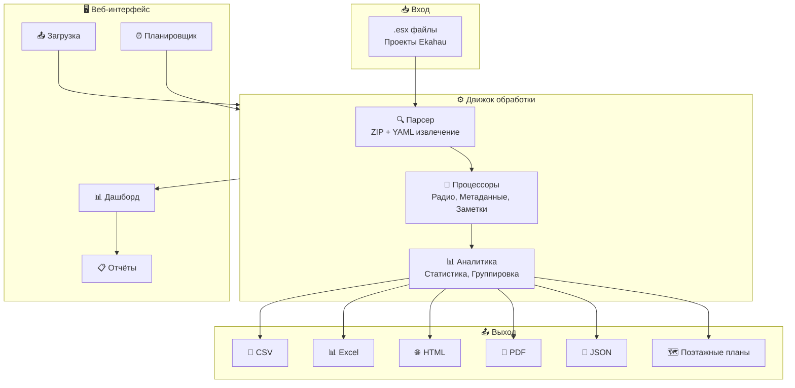
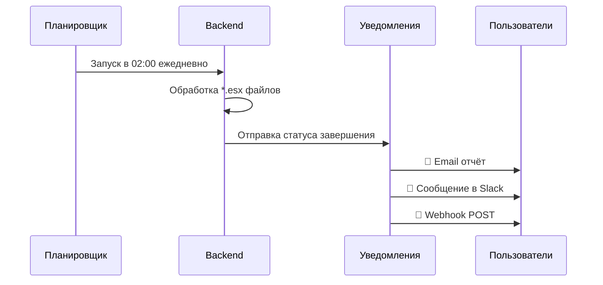

# 📡 EkahauBOM

> **Превратите проекты Ekahau Wi-Fi в профессиональные BOM-отчёты за секунды**

Идеальный инструмент для **Wi-Fi инженеров**: генерация спецификаций оборудования, визуализация размещения точек доступа и автоматизация отчётности из файлов Ekahau .esx.

[](https://www.python.org/downloads/)
[](LICENSE)
[](https://github.com/nimbo78/EkahauBOM/actions/workflows/tests.yml)
[](tests/)
[](https://github.com/nimbo78/EkahauBOM/releases)

[English](README.md) | **Русский**

---

## ✨ Почему Wi-Fi инженеры выбирают EkahauBOM

| До EkahauBOM | После EkahauBOM |
|--------------|-----------------|
| 😩 Ручной подсчёт AP в Ekahau | 🚀 Генерация BOM в один клик |
| 📋 Копирование в Excel | 📊 Профессиональные Excel/PDF отчёты |
| 🖼️ Скриншоты поэтажных планов | 🗺️ PNG высокого разрешения с AP |
| ⏰ Часы рутинной работы | ⚡ Секунды автоматизации |
| 🔄 Повторная обработка вручную | 🤖 Автоматическая обработка по расписанию |

---

## 🌟 Что нового в v3.5.0

### 🐳 Docker контейнеризация (НОВОЕ!)

**Готовые образы из GitHub Container Registry:**
```bash
docker pull ghcr.io/nimbo78/ekahau-bom-backend:latest
docker pull ghcr.io/nimbo78/ekahau-bom-frontend:latest
```

**Запуск одной командой:**
```bash
docker-compose up --build
# Открыть http://localhost:8080
```

**С Keycloak SSO:**
```bash
docker-compose -f docker-compose.yml -f docker-compose.keycloak.yml up --build
```

### 🔐 OAuth2/SSO аутентификация (НОВОЕ!)

**Поддерживаемые провайдеры:**
- Keycloak (рекомендуется)
- Azure AD / Entra ID
- Okta, Google Workspace
- Любой OIDC-совместимый провайдер

**Возможности:**
- Единый вход (SSO)
- Ролевой доступ (admin, user)
- Многофакторная аутентификация (через IdP)

### 📱 Мобильный интерфейс (НОВОЕ!)

**Адаптивный дизайн:**
- Hamburger-меню на мобильных устройствах
- Карточный вид вместо таблиц
- Touch-friendly элементы (мин. 44px)
- Breakpoints: 1024px, 768px, 480px

### 🤖 Автоматизация (v3.4.0)

**Планировщик пакетной обработки** с cron и уведомлениями:
- 📧 Email отчёты команде
- 💬 Уведомления в Slack
- 🔗 Webhook в Jira/ServiceNow

### ⚡ Real-time обновления

- WebSocket статус обработки
- Живой дашборд с графиками
- Мгновенные уведомления

### 💾 S3 хранилище

- AWS S3, MinIO, Wasabi, Cloudflare R2
- Автоматическая избыточность

---

## 🏗️ Архитектура



---

## 🚀 Быстрый старт

### Вариант 1: Веб-интерфейс (Рекомендуется для команд)

```bash
# Клонирование и настройка
git clone https://github.com/nimbo78/EkahauBOM.git
cd EkahauBOM

# Backend (Терминал 1)
cd ekahau_bom_web/backend
python -m venv venv && venv\Scripts\activate  # Linux: source venv/bin/activate
pip install -r requirements.txt
uvicorn app.main:app --port 8001 --reload

# Frontend (Терминал 2)
cd ekahau_bom_web/frontend/ekahau-bom-ui
npm install && npm start

# Откройте http://localhost:4200 🎉
```

### Вариант 2: CLI (Быстро и скриптуемо)

```bash
pip install ekahau-bom

# Простой BOM
ekahau-bom project.esx

# Полный экспорт с визуализациями
ekahau-bom project.esx \
  --format csv,excel,html,pdf \
  --visualize-floor-plans \
  --show-azimuth-arrows

# Пакетная обработка (несколько проектов)
ekahau-bom --batch projects/ \
  --parallel 4 \
  --aggregate-report
```

---

## 🖥️ Возможности веб-интерфейса

### 📤 Загрузка перетаскиванием


Загружайте отдельные файлы или целые пакеты перетаскиванием. Настраивайте параметры обработки и следите за прогрессом в реальном времени.

**Горячие клавиши:**
| Клавиша | Действие |
|---------|----------|
| `Alt+U` | Быстрая загрузка (админ) |
| `Ctrl+K` или `/` | Фокус на поиске |
| `←` `→` | Навигация по вкладкам |
| `1-4` | Переход к вкладке |

### 📊 Панель проектов


Поиск, фильтрация и управление всеми проектами Ekahau. Статус обработки, количество AP и быстрая статистика на одном экране.

### 🗺️ Визуализация поэтажных планов


Интерактивные поэтажные планы с:
- 📍 Наложение размещения AP (цвета Ekahau)
- ➡️ Стрелки азимута для направленных антенн
- 🔍 Управление масштабом/перемещением
- 🖼️ Полноэкранный просмотр в модальном окне

### 📋 Многоформатные отчёты


Скачивайте отчёты в любом формате прямо из браузера:
- **CSV** - Импорт в Excel, базы данных, скрипты
- **Excel** - Профессиональная книга с несколькими листами
- **HTML** - Интерактивный веб-отчёт
- **PDF** - Готовая к печати документация
- **JSON** - Интеграция с другими инструментами

### ⏰ Обработка по расписанию



**Пресеты расписания:**
- 🌅 Ежедневно в 2:00: `0 2 * * *`
- 📅 Еженедельно в понедельник 9:00: `0 9 * * 1`
- 📆 Ежемесячно 1-го числа: `0 0 1 * *`
- ⏱️ Каждый час: `0 * * * *`

---

## 📊 Что в отчётах?

### BOM точек доступа

| Модель | Вендор | Кол-во | Этаж | Диапазон |
|--------|--------|--------|------|----------|
| AP-655 | Aruba | 12 | Этаж 1 | 5GHz |
| C9130AXI | Cisco | 8 | Этаж 2 | 6GHz |
| MR46 | Meraki | 15 | Этаж 3 | Dual |

### Радио-аналитика

- 📶 **Частотные диапазоны**: Распределение 2.4GHz, 5GHz, 6GHz
- 📻 **Каналы**: Анализ использования и перекрытия каналов
- 📡 **Мощность TX**: Распределение уровней мощности
- 🔧 **Стандарты Wi-Fi**: Разбивка по 802.11ax/ac/n

### Параметры установки

- 📍 **Координаты**: X, Y, высота для каждой AP
- 🧭 **Азимут**: Направление антенны
- 📐 **Наклон**: Угол для направленных антенн
- 🏗️ **Монтаж**: Типы крепления (потолок, стена, кронштейн)

### Кабельная инфраструктура

- 📏 **Длина кабелей**: По каждой AP и общая
- 🔌 **Типы кабелей**: Cat6, Cat6A, оптика
- 💰 **Оценка стоимости**: На основе цен на кабель

---

## 🎯 Сценарии использования

### Для Wi-Fi инженеров 📡

```bash
# После завершения проекта в Ekahau
ekahau-bom "Офисное здание Q4.esx" \
  --format excel \
  --visualize-floor-plans \
  --show-azimuth-arrows \
  --output-dir "Материалы для заказчика"
```

**Результат**: Профессиональный BOM + PNG поэтажных планов готовы к передаче заказчику.

### Для отдела закупок 💼

```bash
# Генерация закупочного списка
ekahau-bom project.esx \
  --format csv \
  --group-by vendor
```

**Результат**: CSV сгруппированный по вендорам для заказа.

### Для монтажных бригад 🔧

```bash
# Поэтажное руководство по установке
ekahau-bom project.esx \
  --format html \
  --group-by floor \
  --visualize-floor-plans
```

**Результат**: HTML с расположением AP и деталями монтажа по этажам.

### Для операционных команд 🤖

**Планирование в веб-интерфейсе:**
1. Создайте расписание: "Обрабатывать //fileserver/ekahau/*.esx ежедневно в 2:00"
2. Настройте: Email отчёт на ops-team@company.com
3. Включите: Переключатель и забудьте

**Результат**: Автоматические ежедневные отчёты без ручного вмешательства.

---

## 📁 Структура выходных данных

```
📂 output/
├── 📄 Project_access_points.csv          # Основной BOM
├── 📄 Project_access_points_detailed.csv # Полные детали AP
├── 📄 Project_antennas.csv               # Инвентарь антенн
├── 📄 Project_analytics.csv              # Радио-аналитика
├── 📊 Project_report.xlsx                # Книга Excel
├── 🌐 Project_report.html                # Интерактивный HTML
├── 📑 Project_report.pdf                 # PDF для печати
├── 💾 Project_data.json                  # Машиночитаемый JSON
└── 📂 visualizations/
    ├── 🗺️ Этаж_1_visualization.png
    ├── 🗺️ Этаж_2_visualization.png
    └── 🗺️ Этаж_3_visualization.png
```

---

## ⚙️ Справочник CLI

### Базовые команды

```bash
# Простой экспорт (CSV по умолчанию)
ekahau-bom project.esx

# Несколько форматов
ekahau-bom project.esx --format csv,excel,html,pdf,json

# Свой выходной каталог
ekahau-bom project.esx --output-dir ./reports
```

### Параметры группировки

```bash
--group-by model   # Группировка по модели AP
--group-by floor   # Группировка по этажу
--group-by vendor  # Группировка по вендору (Cisco, Aruba, и т.д.)
--group-by color   # Группировка по цвету Ekahau
--group-by tag     # Группировка по пользовательским тегам
```

### Параметры визуализации

```bash
--visualize-floor-plans    # Генерация PNG поэтажных планов
--show-azimuth-arrows      # Добавить стрелки направления
--ap-opacity 0.6           # Прозрачность наложения (0.1-1.0)
--ap-circle-radius 25      # Размер маркера AP
--no-ap-names              # Скрыть названия AP
```

### Пакетная обработка

```bash
# Обработка всего каталога
ekahau-bom --batch projects/

# Параллельное выполнение (1-8 воркеров)
ekahau-bom --batch projects/ --parallel 4

# С агрегированным отчётом
ekahau-bom --batch projects/ --aggregate-report

# Фильтрация файлов
ekahau-bom --batch projects/ \
  --batch-include "*office*.esx" \
  --batch-exclude "*backup*"
```

---

## 🔧 Конфигурация

### Окружение веб-интерфейса (.env)

```bash
# Хранилище (по умолчанию: local)
STORAGE_BACKEND=local          # или 's3'

# Конфигурация S3 (если используется S3)
S3_BUCKET_NAME=ekahau-bom
S3_REGION=us-east-1
S3_ACCESS_KEY=your_key
S3_SECRET_KEY=your_secret

# Email уведомления (опционально)
SMTP_HOST=smtp.gmail.com
SMTP_PORT=587
SMTP_USERNAME=your-email@gmail.com
SMTP_PASSWORD=your-app-password
SMTP_USE_TLS=true

# Slack уведомления (опционально)
SLACK_WEBHOOK_URL=https://hooks.slack.com/services/...
```

### Варианты хранилища

| Backend | Лучше для | Особенности |
|---------|-----------|-------------|
| **Local** | Один сервер | Просто, автоархивация |
| **AWS S3** | Enterprise | Безлимитно, высокая доступность |
| **MinIO** | Self-hosted | Бесплатно, S3-совместимо |
| **Wasabi** | Экономия | На 80% дешевле AWS |
| **Cloudflare R2** | Много трафика | Без платы за исходящий трафик |

---

## 🧪 Тестирование

```bash
# Запуск всех тестов
pytest tests/ -v

# С отчётом о покрытии
pytest tests/ --cov=ekahau_bom --cov-report=html

# Только быстрые тесты (пропуск медленных интеграционных)
pytest tests/ -m "not slow"
```

**Текущая статистика**: 600+ тестов | 86% покрытие | 3 ОС × 5 версий Python

---

## 📚 Документация

| Документ | Описание |
|----------|----------|
| [Справочник CLI](docs/CLI_REFERENCE.md) | Полный список опций командной строки |
| [Руководство пользователя](docs/USER_GUIDE.ru.md) | Пошаговое руководство |
| [Руководство по Web UI](docs/examples/WEB_UI_GUIDE.ru.md) | Описание веб-интерфейса |
| [Руководство разработчика](docs/DEVELOPER_GUIDE.ru.md) | Участие в разработке |
| [Руководство по расширению](docs/EXTENDING.md) | Добавление экспортёров/процессоров |

---

## 🗺️ Дорожная карта

### ✅ Недавно завершено (v3.5.0)

- [x] 🐳 Docker контейнеризация
- [x] 🔐 OAuth2/Keycloak SSO аутентификация
- [x] 📱 Мобильно-дружественный UI
- [x] 🤖 Пакетная обработка по расписанию с cron
- [x] 📧 Email/Slack/Webhook уведомления
- [x] ⚡ WebSocket обновления в реальном времени
- [x] 📋 Шаблоны пакетов
- [x] 📊 Дашборд аналитики с графиками
- [x] 🏷️ Теги и расширенная фильтрация
- [x] 💾 S3 backend хранилища

### 🔜 В ближайших планах

- [ ] 🔄 Интеграция с Ekahau Cloud
- [ ] 📊 Сравнение версий проектов
- [ ] 📈 Расширенная аналитика

---

## 🤝 Участие в разработке

Приветствуем вклад! Смотрите [CONTRIBUTING.md](CONTRIBUTING.md) для руководства.

```bash
# Настройка окружения разработки
git clone https://github.com/nimbo78/EkahauBOM.git
cd EkahauBOM
pip install -e ".[dev]"
pre-commit install
```

---

## 📄 Лицензия

MIT License - подробности в [LICENSE](LICENSE).

---

## 📧 Контакты

- **Issues**: [GitHub Issues](https://github.com/nimbo78/EkahauBOM/issues)
- **Автор**: Игорь Сингосин

---

<div align="center">

**Создано с ❤️ для сообщества Wi-Fi инженеров**

⭐ Поставьте звезду, если EkahauBOM экономит ваше время!

</div>
