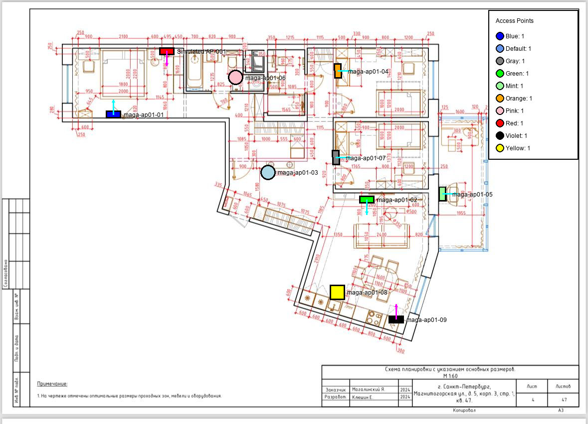

# Examples

This directory contains example outputs from EkahauBOM to demonstrate the tool's capabilities.

## 🌐 Web UI Visual Guide

**NEW!** Check out the [Web UI Visual Guide](WEB_UI_GUIDE.md) ([Русская версия](WEB_UI_GUIDE.ru.md)) with screenshots showing:
- Projects dashboard with statistics
- Upload interface
- Project details and metadata
- Reports download
- Interactive floor plan visualizations
- Lightbox full-screen view

**Less text, more pictures!** 📸 Perfect for understanding the Web interface capabilities.

---

## 📁 CLI Sample Output

You can explore real example outputs in the [`sample_output/`](sample_output/) directory, generated from a test Ekahau project with 10 access points.

## Example Output Types

### 1. Floor Plan Visualizations

**Example**: [maga-flat_visualization.png](sample_output/visualizations/maga-flat_visualization.png)



- **Description**: Floor plan images with AP positions overlaid
- **File Format**: PNG
- **Shows**:
  - Access Point locations with colored markers (10 different colors in sample)
  - AP names/labels
  - Mounting types (ceiling, wall, floor)
  - **Azimuth direction arrows** for directional APs (7 arrows in sample)
  - Legend showing AP count by color

**Sample Features:**
- 10 Access Points with unique colors (Blue, Default, Gray, Green, Mint, Orange, Pink, Red, Violet, Yellow)
- 7 Azimuth direction arrows (pink/red) showing antenna orientation
- Professional floor plan overlay with measurements

### 2. CSV Reports

**Examples**:
- [maga_access_points.csv](sample_output/maga_access_points.csv) - AP summary by model
- [maga_access_points_detailed.csv](sample_output/maga_access_points_detailed.csv) - Detailed AP information
- [maga_antennas.csv](sample_output/maga_antennas.csv) - Antenna specifications
- [maga_analytics.csv](sample_output/maga_analytics.csv) - Analytics metrics

**Contains**:
- **Access Points Summary**: Aggregated AP data by vendor/model
- **Access Points Detailed**: Complete installation parameters (name, floor, color, mounting, azimuth, etc.)
- **Antennas**: Antenna types, gain, frequency bands
- **Analytics**: Radio metrics, band distribution, Wi-Fi standards (802.11ax, 802.11ac, 802.11n)

### 3. HTML Reports

**Example**: [maga_report.html](sample_output/maga_report.html)

- **Format**: Interactive HTML with embedded CSS
- **Features**:
  - Sortable tables with search functionality
  - Responsive design for mobile/desktop
  - Project metadata section (customer, location, responsible person)
  - Grouped analytics (by vendor, floor, color, model)
  - Radio configuration details
  - Professional styling

### 4. JSON Exports

**Example**: [maga_data.json](sample_output/maga_data.json)

- **Format**: Structured JSON data
- **Use Case**: API integration, data processing, custom scripts
- **Contains**: Complete project data including metadata, access points, antennas, radios, notes, network settings, analytics

## How to Generate Examples

```bash
# Generate all formats with visualizations and azimuth arrows
python -m ekahau_bom your_project.esx --output-dir output/ --format csv,json,html --visualize-floor-plans --show-azimuth-arrows

# CSV only
python -m ekahau_bom your_project.esx --format csv

# With custom AP circle size and opacity
python -m ekahau_bom your_project.esx --visualize-floor-plans --ap-circle-radius 20 --ap-opacity 0.7
```

## Contributing Examples

If you have interesting Ekahau projects and would like to contribute example outputs (with appropriate permissions), please open a pull request or issue.

**Note**: Do not include sensitive or proprietary project data in examples.
