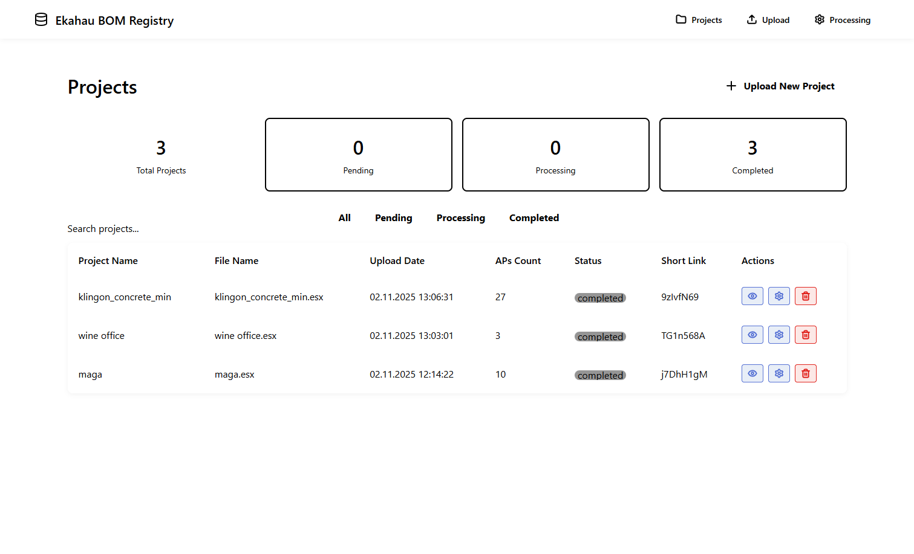
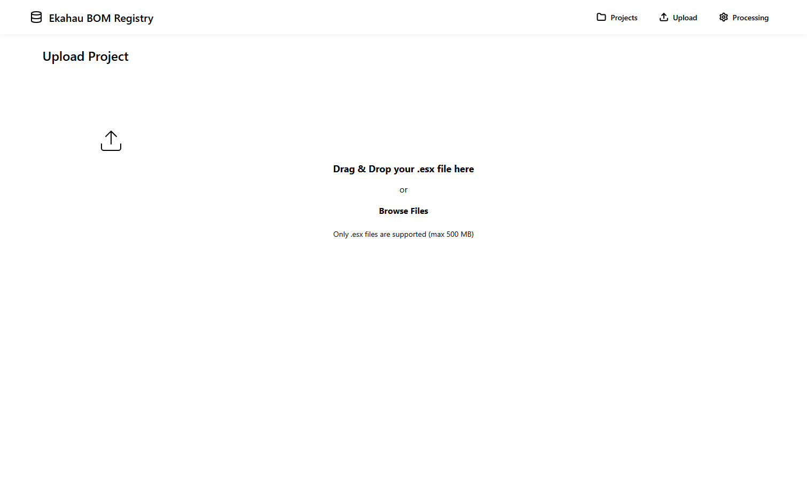
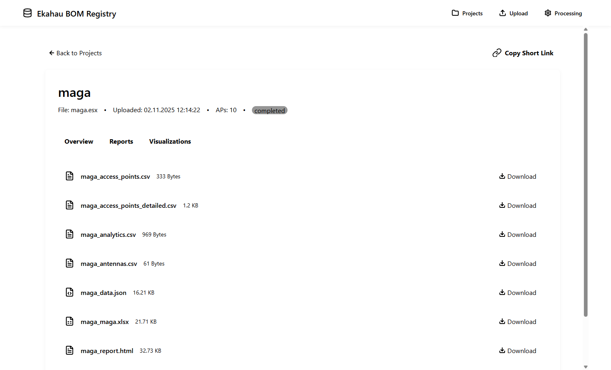
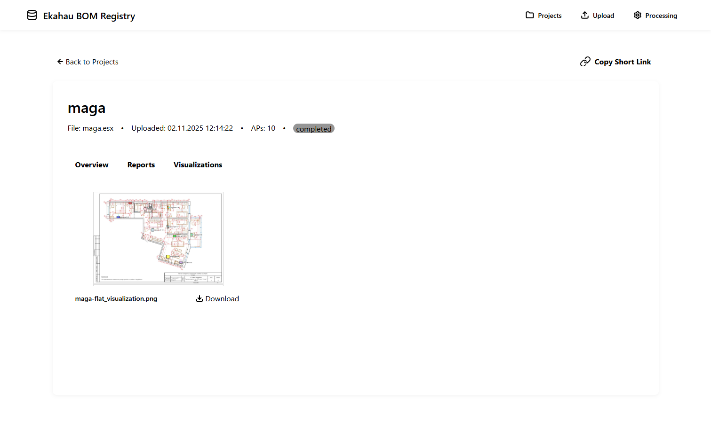
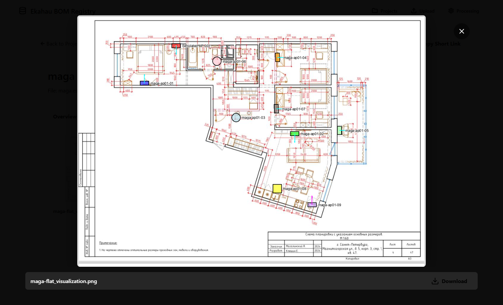

# Визуальное руководство по Web UI

> **Меньше текста, больше картинок!**

## Краткий обзор

Ekahau BOM Web UI предоставляет современный интерфейс для управления и анализа файлов проектов Ekahau.

**Основные возможности**: Загрузка проектов • Обработка данных • Просмотр отчётов • Интерактивные визуализации • Короткие ссылки • Сравнение версий • OAuth2/SSO • Мобильная версия • Docker

---

## Панель проектов

Просмотр всех проектов со статистикой и фильтрами.



**Что отображается**:
- Счётчики: Всего/Ожидает/Обрабатывается/Завершено
- Поиск и фильтры по статусу
- Список проектов с короткими ссылками
- Быстрые действия: Просмотр, Настройка, Удаление

---

## Загрузка проекта

Перетащите `.esx` файлы или выберите через диалог.



**Поддерживается**: `.esx` файлы до 500 МБ

---

## Обзор проекта

Полная информация о проекте и метаданные.


**Отображается**:
- Статус обработки и короткая ссылка
- Заказчик, Локация, Ответственный
- Количество точек доступа, антенн, вендоров
- Этажи и цветовые коды
- Использованные опции обработки

---

## Вкладка отчётов

Скачивание сгенерированных отчётов в различных форматах.



**Доступные форматы**:
- CSV (точки доступа, детальный, аналитика, антенны)
- Excel (`.xlsx`)
- JSON (полные данные)
- HTML (интерактивный)
- PDF (для печати)

---

## Визуализации планов этажей

Интерактивные планы с позициями точек доступа и деталями.



**Возможности**:
- Кликабельные миниатюры
- Скачивание в PNG
- Полноэкранный просмотр

---

## Полноэкранный просмотр

Визуализация на весь экран с увеличением и скачиванием.



**Управление**:
- Клик вне изображения или кнопка X для закрытия
- Кнопка скачивания в нижней части
- Изображения высокого разрешения
- Маркеры точек доступа с названиями
- Стрелки азимута (если включено)

---

## Вкладка сравнения _(Новое в v3.6.0)_

Сравнение версий проекта при обновлении существующего проекта.

**Когда отображается**: Вкладка "Сравнение" появляется когда вы выбираете "Обновить существующий проект" при загрузке и данные сравнения доступны.

**Что отображается**:
- **Карточки сводки**: Количество изменений по категориям
  - Добавлено (зелёный) • Удалено (красный) • Изменено (жёлтый) • Перемещено (синий) • Переименовано (оранжевый)
- **Таблица изменений**: Фильтрация по статусу и этажу
  - Колонки: Имя AP, Статус, Этаж, Детали
- **Галерея визуального сравнения**: Изображения планов этажей с изменениями
  - Клик по миниатюре для полноразмерного просмотра
- **Скачивание отчётов**: CSV, Excel, HTML отчёты сравнения

**Легенда визуального сравнения**:
| Маркер | Значение |
|--------|----------|
| 🟢 Зелёный круг | Добавлена AP |
| 🔴 Красный круг | Удалена AP |
| 🟡 Жёлтый круг | Изменена AP |
| 🔵→🟣 Стрелка | Перемещена AP |
| 🟠 Оранжевый круг | Переименована AP |

---

## OAuth2/Keycloak SSO (Новое в v3.5.0)

Поддержка корпоративной аутентификации через OAuth2/OIDC.

**Поддерживаемые провайдеры**:
- Keycloak (рекомендуется)
- Azure AD / Entra ID
- Okta
- Google Workspace
- Любой OIDC-совместимый провайдер

**Возможности**:
- Единый вход (SSO)
- Ролевой доступ (admin, user)
- Многофакторная аутентификация (через IdP)

---

## Мобильная версия (Новое в v3.5.0)

Адаптивный интерфейс для планшетов и смартфонов.

**Особенности**:
- Hamburger-меню на мобильных устройствах
- Карточный вид вместо таблиц
- Touch-friendly элементы (мин. 44px)
- Горизонтальная прокрутка вкладок

**Breakpoints**:
- Планшет: < 1024px
- Мобильный: < 768px
- Маленький экран: < 480px

---

## Быстрый старт

### Вариант 1: Docker (рекомендуется)

```bash
# Клонировать репозиторий
git clone https://github.com/htechno/EkahauBOM.git
cd EkahauBOM

# Скопировать конфигурацию
cp .env.example .env

# Запустить
docker-compose up --build

# Открыть http://localhost:8080
```

### Вариант 2: С Keycloak SSO

```bash
docker-compose -f docker-compose.yml -f docker-compose.keycloak.yml up --build

# Keycloak: http://localhost:8180 (admin/admin)
# Приложение: http://localhost:8080
```

### Вариант 3: Локальная разработка

#### 1. Запустить Backend (Терминал 1)
```bash
cd ekahau_bom_web/backend
./venv/Scripts/activate  # Windows
# или: source venv/bin/activate  # Linux/Mac
python -m uvicorn app.main:app --port 8001
```

#### 2. Запустить Frontend (Терминал 2)
```bash
cd ekahau_bom_web/frontend/ekahau-bom-ui
npm start
```

#### 3. Открыть браузер
Перейти на: **http://localhost:4200**

---

## Docker Deployment

### Структура

```
docker-compose.yml
├── backend (FastAPI + EkahauBOM CLI)
│   └── Dockerfile
├── frontend (Angular + Nginx)
│   └── Dockerfile
└── keycloak (опционально)
    └── docker-compose.keycloak.yml
```

### Переменные окружения (.env)

```bash
# Аутентификация
AUTH_BACKEND=simple           # или "oauth2"
ADMIN_USERNAME=admin
ADMIN_PASSWORD=admin123
JWT_SECRET_KEY=change-me

# OAuth2 (когда AUTH_BACKEND=oauth2)
OAUTH2_ISSUER=http://localhost:8180/realms/ekahau
OAUTH2_CLIENT_ID=ekahau-bom-web
OAUTH2_CLIENT_SECRET=your-secret

# Порт приложения
FRONTEND_PORT=8080
```

---

## Технологический стек

- **Frontend**: Angular 20 • Taiga UI v4.60.0 • TypeScript
- **Backend**: FastAPI • Python 3.11+ • EkahauBOM CLI
- **Хранилище**: JSON метаданные • Файловая система • S3 (опционально)
- **Аутентификация**: JWT • OAuth2/OIDC
- **Деплой**: Docker • Nginx • docker-compose

---

## Горячие клавиши

**Глобальные:**
- `Alt+U` - Перейти к загрузке (только админ)
- `Ctrl+K` или `/` - Фокус на поиске
- `Escape` - Очистить поиск

**Детали проекта:**
- `←` / `→` - Навигация по вкладкам
- `1-4` - Перейти к вкладке (Обзор, Отчёты, Визуализации, Заметки)

---

## Ссылки

- [Главный README](../../README.md)
- [Документация Web UI](../../ekahau_bom_web/README.md)
- [Примеры CLI](README.md)
- [Примеры конфигурации](config-examples.md)

---

**Версия**: 3.6.0
**Последнее обновление**: 2025-12-16

**Нужна помощь?** Откройте issue на GitHub или обратитесь к документации.
